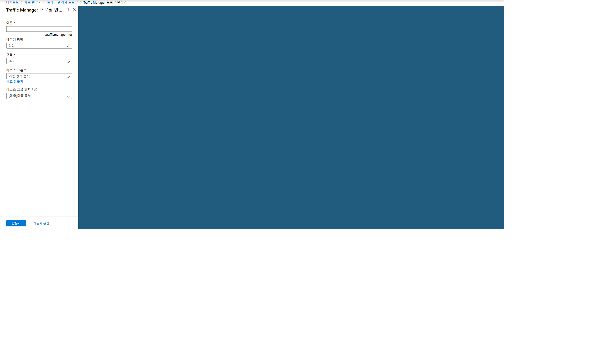

## 라우팅 방법
+ **우선 순위**: 모든 트래픽에 대해 기본 서비스 엔드포인트를 사용하고 기본 또는 백업 엔드포인트를 사용할 수 없을 때 백업을 제공하려면 우선 순위를 선택합니다.

+ **가중**: 여러 엔드포인트에 균일하게 또는 정의한 가중치에 따라 트래픽을 분산하려면 가중을 선택합니다.

+ **성능**: 엔드포인트가 서로 다른 지역에 있고 최종 사용자가 가장 짧은 네트워크 대기 시간을 기준으로 "가장 가까운" 엔드포인트를 사용하게 하려는 경우 성능을 선택합니다.

+ **지리적**: 사용자가 해당 DNS 쿼리가 시작된 지리적 위치를 기준으로 특정 엔드포인트(Azure, 외부 또는 중첩)로 리디렉션되게 하려면 지리적을 선택합니다. 이렇게 하면 Traffic Manager 고객이 사용자의 지리적 위치를 파악하고 그에 따라 라우팅되는 중요한 시나리오를 사용할 수 있습니다. 데이터 독립성 지시 사항, 콘텐츠 및 사용자 환경의 지역화를 준수하고 다른 지역의 트래픽을 측정하는 작업을 예로 들 수 있습니다.

+ **다중값**: 엔드포인트로 IPv4/IPv6 주소만 사용할 수 있는 Traffic Manager 프로필의 경우 다중값을 선택합니다. 이 프로필에 대해 쿼리가 수신되면 정상 상태의 모든 엔드포인트가 반환됩니다.

+ **서브넷**: 최종 사용자 IP 주소 범위 집합을 Traffic Manager 프로필 내의 특정 엔드포인트로 매핑하려면 서브넷 트래픽 라우팅 방법을 선택합니다. 요청이 수신되면 해당 요청의 원본 IP 주소에 대해 매핑될 엔드포인트가 반환됩니다. 

## 조건
+ webapp 2개(서로 다른 지역)

## 만들기
>리소스 만들기 > Traffic Manager Profile

|설정|값|
|:---|:---|
|라우팅방법|성능|

## 추가
>Traffic Manager 프로필 > 설정 > 엔드포인트1 추가

|설정|값|
|:---|:---|
|형식|Azure endpoint|
|대상 리소스 종류|App Service|
|대상 리소스|1번째 앱|

>Traffic Manager 프로필 > 설정 > 엔드포인트2 추가

|설정|값|
|:---|:---|
|형식|Azure endpoint|
|대상 리소스 종류|App Service|
|대상 리소스|2번째 앱|

